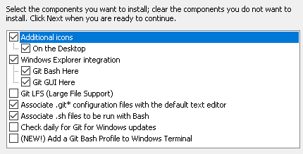
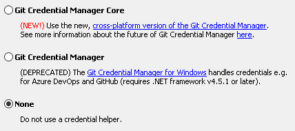
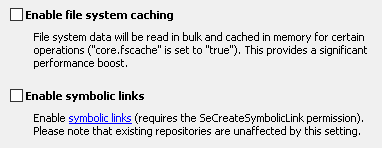

# Installation of Labber Driver for compact_2012

## Pathnames

Tag | Default | Comment
-- | -- | --
`<LABBERDIR>` | `C:\Program Files\Labber` | Labber installation directory
`<LABBERPY32>` | `C:\Program Files\Labber\python-labber-32` | Labber Python 32 bit
`<LABBERPY64>` | `C:\Program Files\Labber\python-labber` | Labber Python 64 bit
`<LABBERDRIVERS>` | `C:\Program Files\Labber\Drivers` | Labber drivers
`<LABBERLOCALDRIVERS>` | `C:\Users\localadmin\Labber\Drivers` | Labber local drivers. `localadmin` is the logged in user
`<GITBIN>` | `C:\Program Files\Git\bin` | Git binaries

Mapping Tag to Labber Preferences

Tag        | Labber Instrument Server, Menu Preferences
-- | --
`<LABBERDIR>` | Tab Advanced, Application Folder
`<LABBERDRIVERS>` | Tab Folders, Instrument Drivers
`<LABBERLOCALDRIVERS>` | Tab Folders, Local Drivers


## Prerequisits

### Labber 1.7.7 installed.

### git installed.

Navigate to https://git-scm.com/download/win and download "64-bit Git for Windows Setup". Currently, this is: [Git-2.32.0-64-bit.exe](https://github.com/git-for-windows/git/releases/download/v2.32.0.windows.1/Git-2.32.0-64-bit.exe).








## Install compact_2012 labber driver

### Clone git repository

Run `cmd.exe`:
```bash
cd C:\Users\localadmin\Labber\Drivers
git clone https://github.com/nanophysics/compact_2012
cd compact_2012
```

### Install python requirements

Run `cmd.exe` below as **Administrator**.
```bash
cd C:\Users\localadmin\Labber\Drivers\compact_2012

"C:\Program Files\Labber\python-labber\Scripts\pip.exe" install --force-reinstall --no-cache-dir -r requirements.txt
```

There will be some warnings about *PATH*. You may ignore them.

The last line should be `Successfully installed ...`!

Above command will install the required python libraries in `C:\Program Files\Labber\python-labber` (Labber 64bit Python).

## Configure the compact_2012 in the Labber Instrument Server

Start the Labber Instrument Server and choose menu `Edit -> Add...`


## Update the compact_2012 driver and calibration data

The driver AND the calibration data is stored in the git repository located at `<LABBERLOCALDRIVERS>\compact_2012`.

Double click `<LABBERLOCALDRIVERS>\compact_2012\run_git_pull.bat` to pull the newest version.
