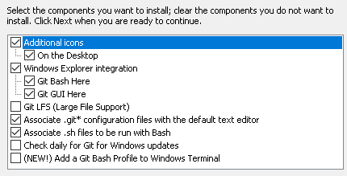
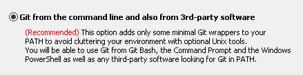
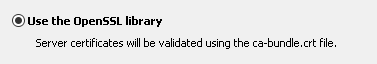
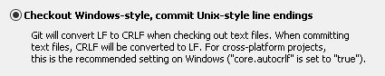
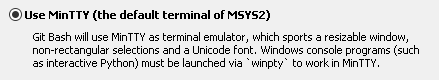
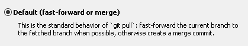
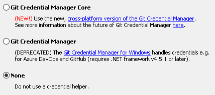
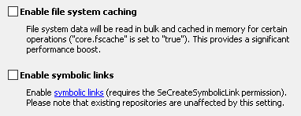

# Git installation

## configuration required after installation

```
git config --global user.email "user@ethz.ch"
git config --global user.name "Hans Maerki"
```

## git installation

Navigate to https://git-scm.com/download/win and download "64-bit Git for Windows Setup". Currently, this is: [Git-2.32.0-64-bit.exe](https://github.com/git-for-windows/git/releases/download/v2.32.0.windows.1/Git-2.32.0-64-bit.exe).
















